# LINUX BASICS

## Contents
1. [Установка ОС](#part-1-установка-ос)  
2. [Создание пользователя](#part-2-создание-пользователя)  
3. [Настройка сети ОС](#part-3-настройка-сети-ос)   
4. [Обновление ОС](#part-4-обновление-ос)  
5. [Использование команды  sudo](#part-5-использование-команды-sudo)  
6. [Установка и настройка службы времени](#part-6-установка-и-настройка-службы-времени)  
7. [Установка и использование текстовых редакторов](#part-7-установка-и-использование-текстовых-редакторов)  
8. [Установка и базовая настройка сервиса SSHD](#part-8-установка-и-базовая-настройка-сервиса-sshd)   
9. [Установка и использование утилит top, htop](#part-9-установка-и-использование-утилит-top-htop)   
10. [Использование утилиты fdisk](#part-10-использование-утилиты-fdisk)   
11. [Использование утилиты df](#part-11-использование-утилиты-df)    
12. [Использование утилиты du](#part-12-использование-утилиты-du)    
13. [Установка и использование утилиты ncdu](#part-13-установка-и-использование-утилиты-ncdu)    
14. [Работа с системными журналами](#part-14-работа-с-системными-журналами)     
15. [Использование планировщика заданий CRON](#part-15-использование-планировщика-заданий-cron)

## Part 1. Установка ОС

**== Задание ==**

##### Установить **Ubuntu 20.04 Server LTS** без графического интерфейса. (Используем программу для виртуализации - VirtualBox)

- Графический интерфейс должен отсутствовать.

- Узнайте версию Ubuntu, выполнив команду \
`cat /etc/issue.`
- Вставьте скриншот с выводом команды.

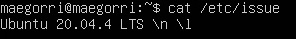 | 
|:--:| 
| *Версия Ubuntu* |

## Part 2. Создание пользователя

**== Задание ==**

##### Создать пользователя, отличного от пользователя, который создавался при установке. Пользователь должен быть добавлен в группу `adm`.

- Вставьте скриншот вызова команды для создания пользователя.
- Новый пользователь должен быть в выводе команды \
`cat /etc/passwd`
- Вставьте скриншот с выводом команды.

| 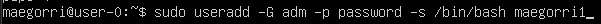 | 
|:--:| 
| *Команда для создания пользователя* |
||
| 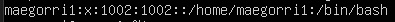 |
| *Вывод команды `cat /etc/passwd`* |

## Part 3. Настройка сети ОС

**== Задание ==**

##### Задать название машины вида user-1  
##### Установить временную зону, соответствующую вашему текущему местоположению.  
##### Вывести названия сетевых интерфейсов с помощью консольной команды.
- В отчёте дать объяснение наличию интерфейса lo.  
##### Используя консольную команду получить ip адрес устройства, на котором вы работаете, от DHCP сервера. 
- В отчёте дать расшифровку DHCP.  
##### Определить и вывести на экран внешний ip-адрес шлюза (ip) и внутренний IP-адрес шлюза, он же ip-адрес по умолчанию (gw). 
##### Задать статичные (заданные вручную, а не полученные от DHCP сервера) настройки ip, gw, dns (использовать публичный DNS серверы, например 1.1.1.1 или 8.8.8.8).  
##### Перезагрузить виртуальную машину. Убедиться, что статичные сетевые настройки (ip, gw, dns) соответствуют заданным в предыдущем пункте.  

- В отчёте опишите, что сделали для выполнения всех семи пунктов (можно как текстом, так и скриншотами).
- Успешно пропинговать удаленные хосты 1.1.1.1 и ya.ru и вставить в отчёт скрин с выводом команды. В выводе команды должна быть фраза "0% packet loss".

1. Задание названия машины: 

    | Команда | `sudo hostname user-1` |
    |:-|-:| 
    | 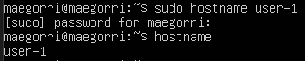 |
    | *Вывод имени хоста* |

2. Установка временной зоны:

    | Команда | `sudo dpkg-reconfigure tzdata` |
    |:-|-:| 
    | 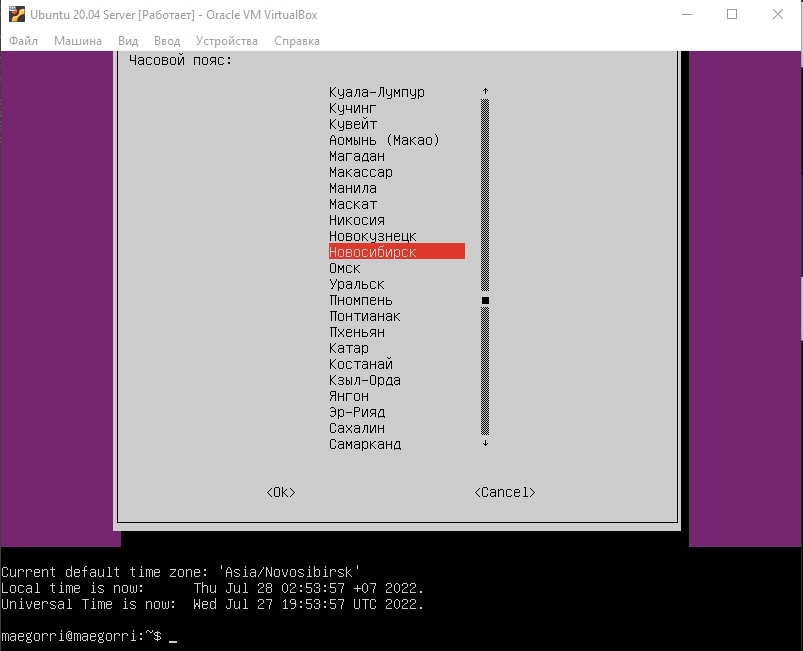 |
    | *Вывод информации о временной зоне* |

3. Названия сетевых интерфейсов:

    | Команда | `ls /sys/class/net` |
    |:-|-:| 
    | 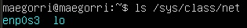 |
    | *Вывод информации о сетевых интерфейсах* |

    - *lo-интерфейс (loopback/локальная петля)* - используется для того, чтобы компьютер мог обращаться к самому себе, и имеет по умолчанию ip-адрес 127.0.0.1 на всех компьютерах.  

4. Получение IP-адреса:

    | Команда | `ip r` |
    |:-|-:| 
    | 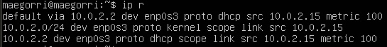 |
    | *Вывод IP-адреса* |
    
    - *DHCP* - Dynamic Host Configuration Protocol (протокол динамической настройки узла). Позволяет сетевым устройствам автоматически получать IP-адрес и другие необходимые параметры.

5. Вывод ip-адреса по умолчанию (gw):

    | Команда | `ip r` |
    |:-|-:| 
    |  |
    | *Вывод IP-адреса по умолчанию (default)* |

6. Задание статичных настроек ip, gw, dns:

    | Команда | `sudo nano /etc/netplan/00-installer-config.yaml` |
    |:-|-:| 
    | 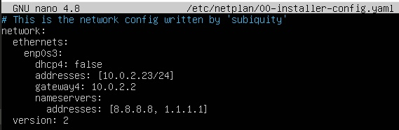 |
    | *Измененное содержимое файла 00-installer-config.yaml* |
    ||
    | Команда | `sudo netplan try` |
    | 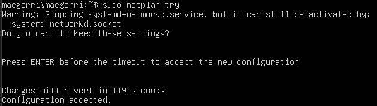 |
    | *Сохранение настроек* |

7. После перезагрузки статичные настройки соответствуют настройкам из предыдущего пункта:

    | 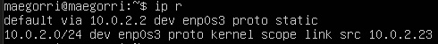 |
    |:--:|
    | *Настройки после перезагрузки* |
    ||
    | 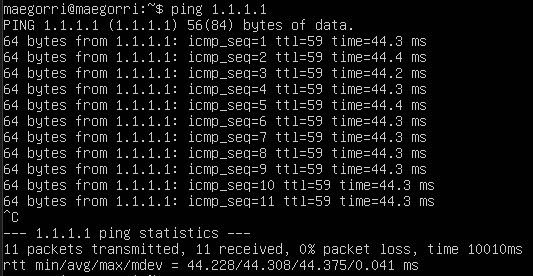 |
    | *Ping 1.1.1.1* |
    ||
    | 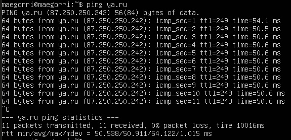 |
    | *Ping ya.ru* |

## Part 4. Обновление ОС

**== Задание ==**

##### Обновить системные пакеты до последней на момент выполнения задания версии.  

- После обновления системных пакетов, если ввести команду обновления повторно, должно появится сообщение, что обновления отсутствуют.
- Вставить скриншот с этим сообщением в отчёт.

| 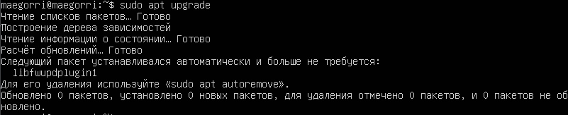 |
|:--:| 
| *Проверка наличия обновлений* |

## Part 5. Использование команды **sudo**

**== Задание ==**

##### Разрешить пользователю, созданному в [Part 2](#part-2-создание-пользователя), выполнять команду sudo.

- В отчёте объяснить *истинное* назначение команды sudo (про то, что это слово - "волшебное", писать не стоит).  
- Поменять hostname ОС от имени пользователя, созданного в пункте [Part 2](#part-2-создание-пользователя) (используя sudo).
- Вставить скрин с изменённым hostname в отчёт.

| 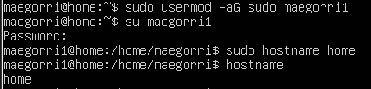 |
|:--:| 
| *Изменение hostname* |

- **Sudo** это команда, которая запускает переданную ей команду от имени суперпользователя (без ввода пароля).

## Part 6. Установка и настройка службы времени

**== Задание ==**

##### Настроить службу автоматической синхронизации времени.  

- Вывести время, часового пояса, в котором вы сейчас находитесь.
- Вывод следующей команды должен содержать `NTPSynchronized=yes`: \
  `timedatectl show`
- Вставить скрины с корректным временем и выводом команды в отчёт.

| 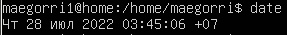 |
|:--:| 
| *Актуальное время* |
||
| 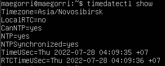 |
| *Вывод команды **timedatectl show*** |

## Part 7. Установка и использование текстовых редакторов

**== Задание ==**

##### Установить текстовые редакторы **VIM** (+ любые два по желанию **NANO**, **MCEDIT**, **JOE** и т.д.)  
##### Используя каждый из трех выбранных редакторов, создайте файл *test_X.txt*, где X -- название редактора, в котором создан файл. Напишите в нём свой никнейм, закройте файл с сохранением изменений.  
- В отчёт вставьте скриншоты:
  - Из каждого редактора с содержимым файла перед закрытием.
- В отчёте укажите, что сделали для выхода с сохранением изменений.
##### Используя каждый из трех выбранных редакторов, откройте файл на редактирование, отредактируйте файл, заменив никнейм на строку "21 School 21", закройте файл без сохранения изменений.
- В отчёт вставьте скриншоты:
    - Из каждого редактора с содержимым файла после редактирования.
- В отчёте укажите, что сделали для выхода без сохранения изменений.
##### Используя каждый из трех выбранных редакторов, отредактируйте файл ещё раз (по аналогии с предыдущим пунктом), а затем освойте функции поиска по содержимому файла (слово) и замены слова на любое другое.
- В отчёт вставьте скриншоты:
    - Из каждого редактора с результатами поиска слова.
    - Из каждого редактора с командами, введёнными для замены слова на другое.

1. Выход с сохранением

    - VIM

        | Команда | `"esc" + ":wq"` |
        |:-|-:| 
        | 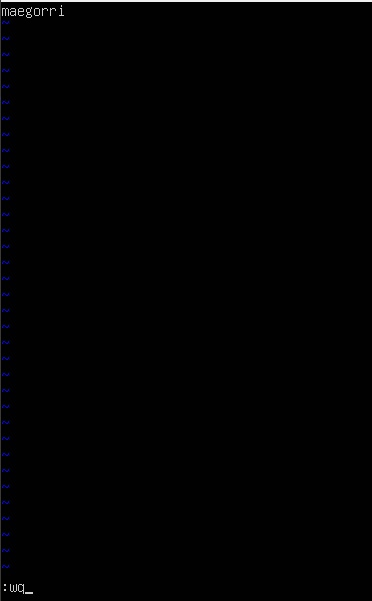 |
        | *Содержимое файла test_vim.txt* |

    - Nano

        | Команда | `ctrl+X + "y"` |
        |:-|-:| 
        | 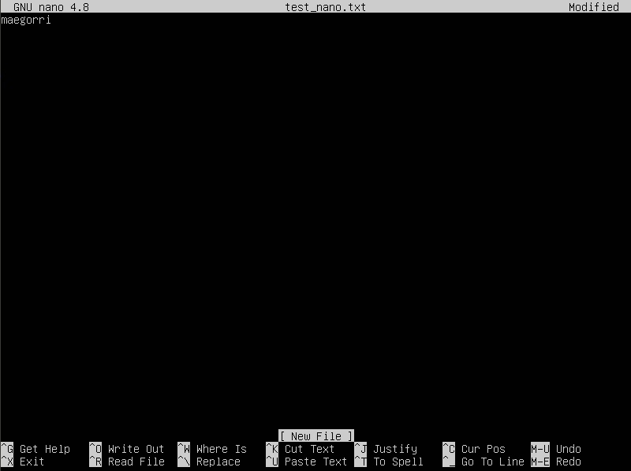 |
        | *Содержимое файла test_nano.txt* |

    - Emacs

        | Команда | `ctrl+X + ctrl+C + "y"` |
        |:-|-:| 
        | 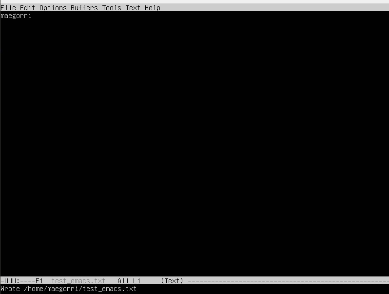 |
        | *Содержимое файла test_emacs.txt* |

2. Выход без сохранения

    - VIM

        | Команда | `"esc" + ":q!"` |
        |:-|-:| 
        | 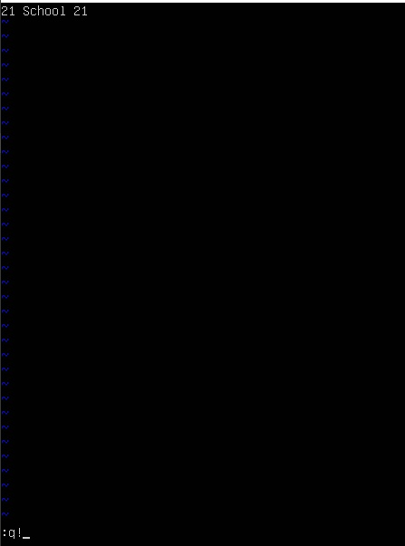 |
        | *Содержимое файла test_vim.txt после изменения* |

    - Nano

        | Команда | `ctrl+X + "n"` |
        |:-|-:| 
        | 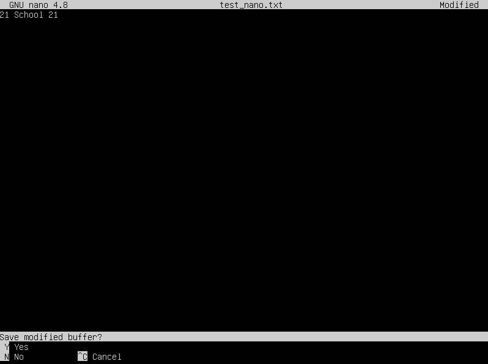 |
        | *Содержимое файла test_nano.txt после изменения* |

    - Emacs

        | Команда | `ctrl+X + ctrl+C + "n" + "yes"` |
        |:-|-:| 
        | 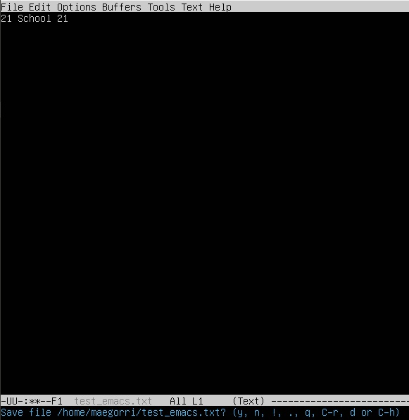 |
        | *Содержимое файла test_emacs.txt после изменения* |

3. Поиск по содержимому файла и замена слова на любое другое

    - VIM

        | Команда | `"esc" + "/WORD"` |
        |:-|-:| 
        | 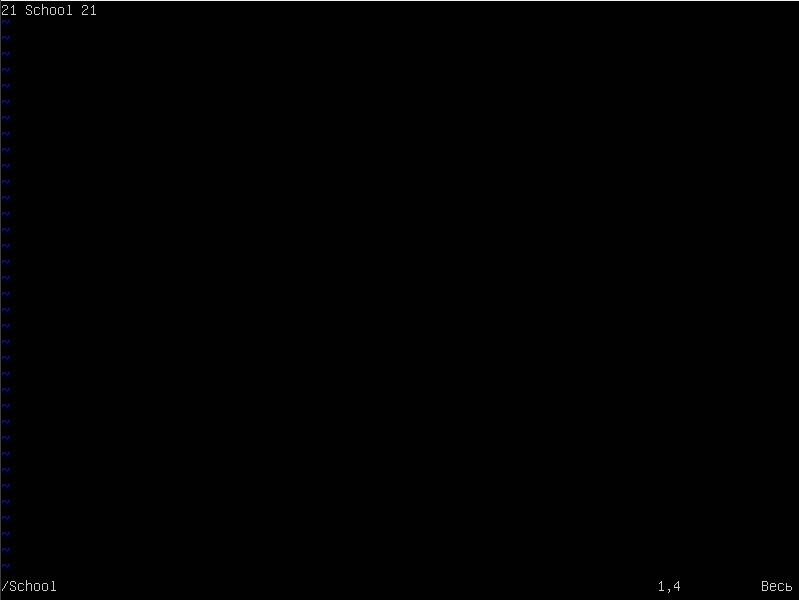 |
        | *Поиск в test_vim.txt* |
        ||
        | Команда | `"esc" + ":s/WORD/CHANGE/g"` |
        |  |
        | *Замена в test_vim.txt* |

    - Nano

        | Команда | `ctrl+W` |
        |:-|-:| 
        |  |
        | *Поиск в test_nano.txt* |
        ||
        | Команда | `ctrl+/` |
        | 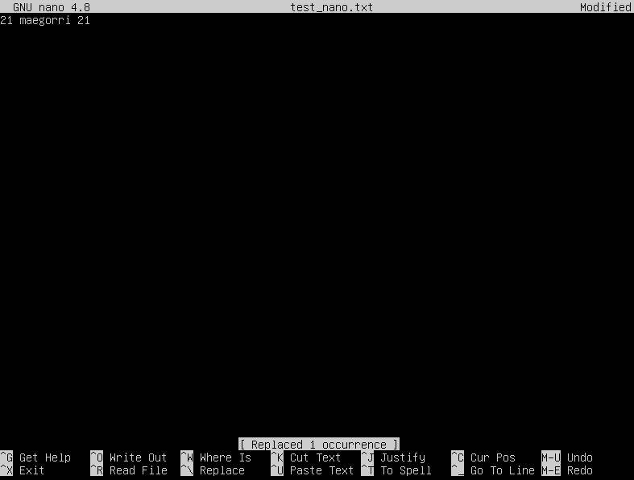 |
        | *Замена в test_nano.txt* |

    - Emacs

        | Команда | `ctrl+S` |
        |:-|-:| 
        | 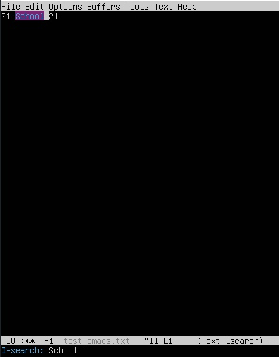 |
        | *Поиск в test_emacs.txt* |
        ||
        | Команда | `alt+%` |
        | 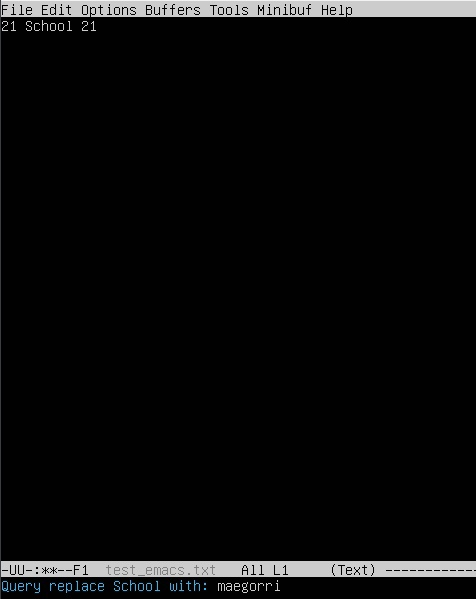 |
        | *Замена в test_emacs.txt* |

## Part 8. Установка и базовая настройка сервиса **SSHD**

**== Задание ==**

##### Установить службу SSHd.  
##### Добавить автостарт службы при загрузке системы.  
##### Перенастроить службу SSHd на порт 2022.  
##### Используя команду ps, показать наличие процесса sshd. Для этого к команде нужно подобрать ключи.
- В отчёте объяснить значение команды и каждого ключа в ней.
##### Перезагрузить систему.
- В отчёте опишите, что сделали для выполнения всех пяти пунктов (можно как текстом, так и скриншотами).
- Вывод команды netstat -tan должен содержать  \
`tcp 0 0 0.0.0.0:2022 0.0.0.0:* LISTEN`  \
(если команды netstat нет, то ее нужно установить)
- Скрин с выводом команды вставить в отчёт.
- В отчёте объяснить значение ключей -tan, значение каждого столбца вывода, значение 0.0.0.0.

1. Установка SSHd

    `sudo apt install openssh-server`

2. Добавление автостарта

    | 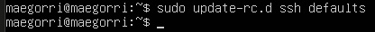 |
    |:--:| 
    | *Добавление автостарта* |

3. Перенастройка порта в файле `/etc/ssh/sshd_config`

    | 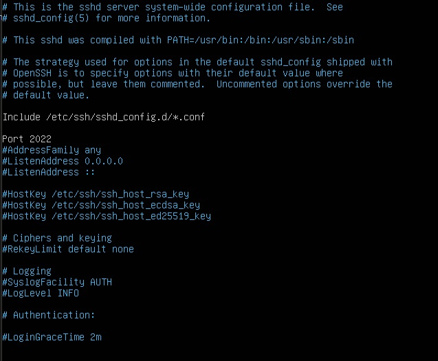 |
    |:--:| 
    | *Замена порта* |
    ||
    | 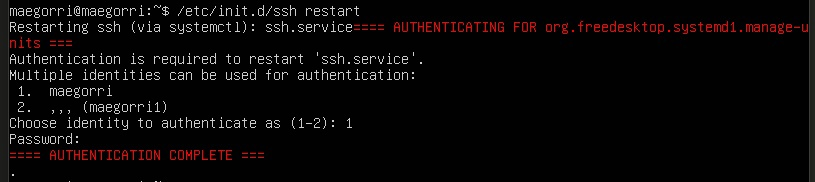 |
    | *Для сохранения используем `/etc/init.d/ssh restart`* |

4. Использование команды `ps`. Она используется для отображения текущих работающих процессов на сервере и информации о них.

    | 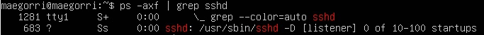 |
    |:--:| 
    | *Вывод команды `ps`* |

    Значения флагов: 
    - `-a`: выводит все процессы
    - `-x`: показывает только те процессы, чьим владельцем являюсь я
    - `-f`: выводит подробную информацию о процессах

5.  Использование команды `netstat`  

    | 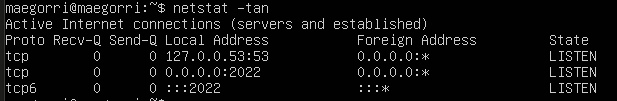 |
    |:--:| 
    | *Вывод команды netstat* |

    - Значения ключей:
        - `-a`: показывает состояние всех сокетов
        - `-t`: показывает только tcp соединения
        - `-n`: показывает IP-адреса вместо имен хостов

    - Значения столбцов:
        - `Proto`: протокол, используемый сокетом
        - `Recv-Q`: количество байтов, не скопированных паользователем, подключенным к этому сокету
        - `Send-Q`: количество байтов, не подтвержденных удаленным хостом
        - `Local Address`: локальный адрес и номер порта сокета
        - `Foreign Address`: удаленный адрес и номер порта сокета
        - `State`: состояние сокета
    - Значение `0.0.0.0`: (групповой/неуказанный адрес) - не маршрутизируемый адрес, который используется для определения неизвестного или недействительного объекта. На серверах обозначает все IPv4 адреса на локальной машине (нужно для мониторинга трафика на устройствах с несколькими сетевыми интерфейсами).

## Part 9. Установка и использование утилит **top**, **htop**

**== Задание ==**

##### Установить и запустить утилиты top и htop.  

- По выводу команды top определить и написать в отчёте:
  - uptime
  - количество авторизованных пользователей
  - общую загрузку системы
  - общее количество процессов
  - загрузку cpu
  - загрузку памяти
  - pid процесса занимающего больше всего памяти
  - pid процесса, занимающего больше всего процессорного времени
- В отчёт вставить скрин с выводом команды htop:
  - отсортированному по PID, PERCENT_CPU, PERCENT_MEM, TIME
  - отфильтрованному для процесса sshd
  - с процессом syslog, найденным, используя поиск 
  - с добавленным выводом hostname, clock и uptime  

1. Команда `top`

    | 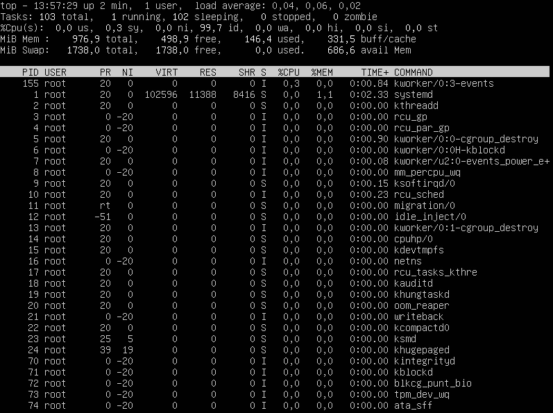 |
    |:--:| 
    | *Вывод команды `top`* |

        - uptime: 2 мин
        - количество авторизованных пользователей: 1
        - общая загрузка системы: 0.04, 0.06, 0.02
        - общее количество процессов: 103 total, 1 running, 102 sleeping
        - загрузка cpu: 0.0, 0.3, 99.7 
        - загрузка памяти: 976.9 total, 498.9 free, 146.4 used 
        - pid процесса, занимающего больше всего памяти: 636
        - pid процесса, занимающего больше всего процессорного времени: 155

2. Команда `htop`

    | 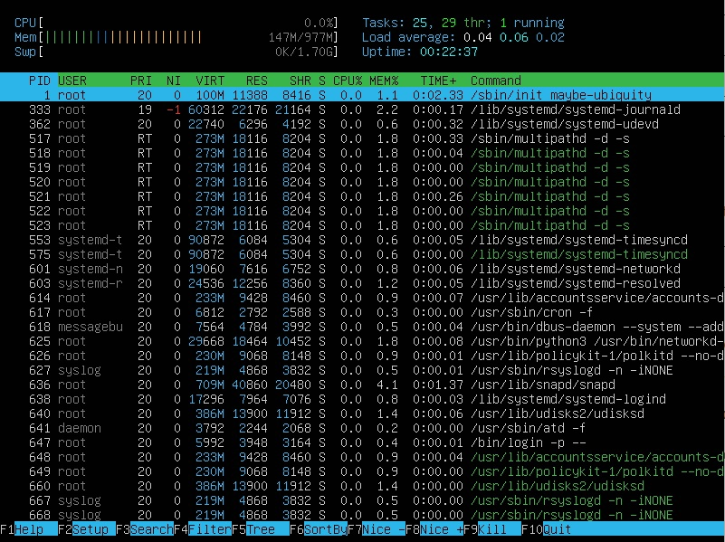 |
    |:--:| 
    | *Сортировка по PID* |
    ||
    | 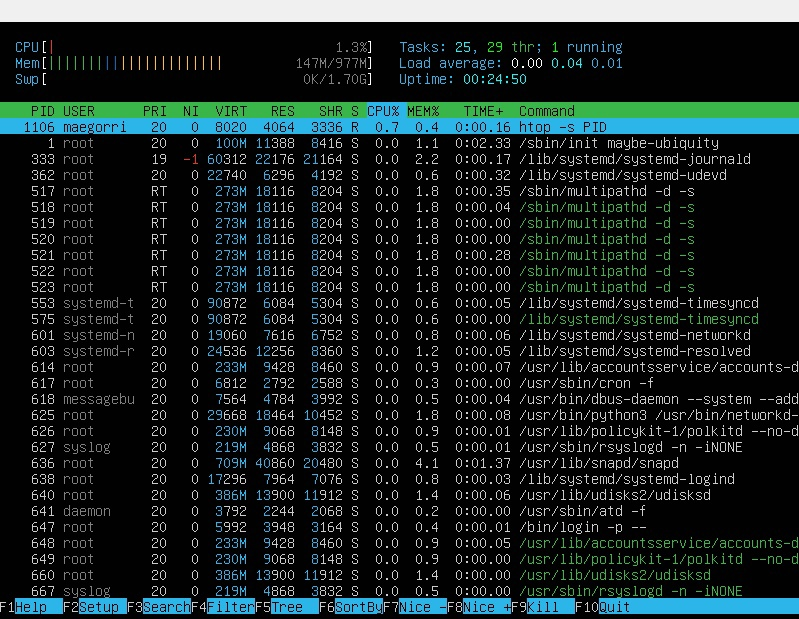 |
    | *Сортировка по PERCENT_CPU* |
    ||
    | 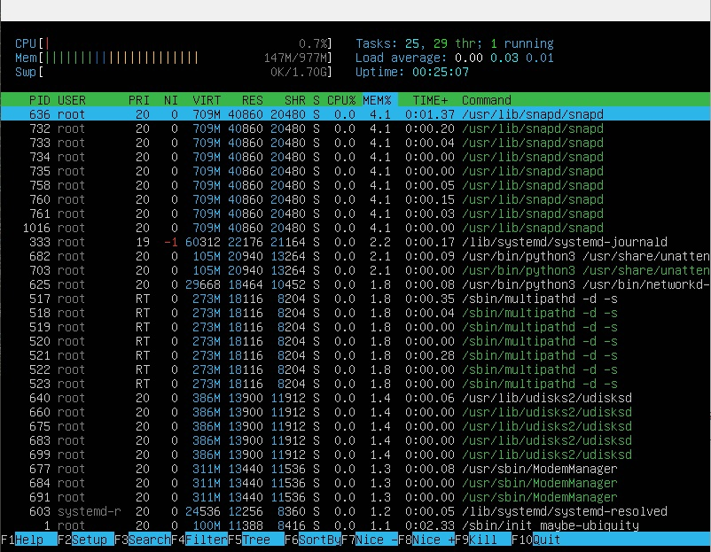 |
    | *Сортировка по PERCENT_MEM* |
    ||
    | 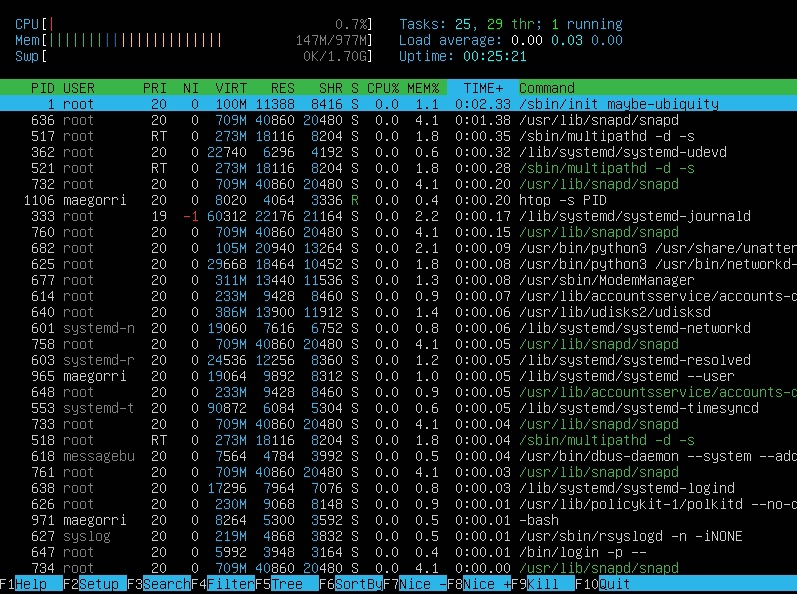 |
    | *Сортировка по TIME* |
    ||
    | 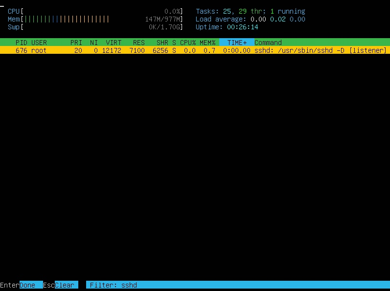 |
    | *Фильтр для процесса sshd* |
    ||
    | 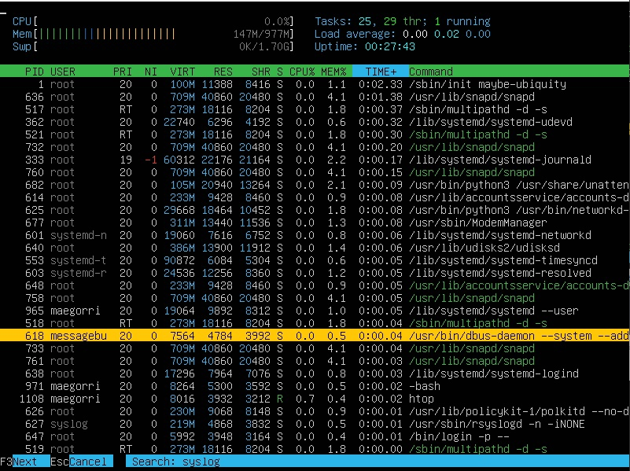 |
    | *Поиск процесса syslog* |
    ||
    | 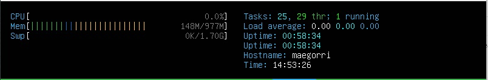 |
    | *Добавленный вывод hostname, clock, uptime* |

## Part 10. Использование утилиты **fdisk**

**== Задание ==**

##### Запустить команду fdisk -l.

- В отчёте написать название жесткого диска, его размер и количество секторов, а также размер swap.

| 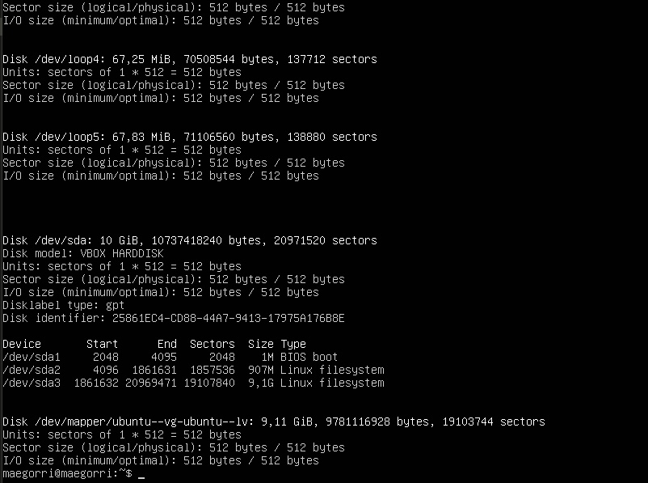 |
|:--:| 
| *Вывод команды `fdisk -l`* |

    - Название жесткого диска: /dev/sda, VBOX HARDDISK
    - Размер: 10 GiB
    - Количество секторов: 20971520 sectors
    - Размер swap: 0

## Part 11. Использование утилиты **df** 

**== Задание ==**

##### Запустить команду df.  
- В отчёте написать для корневого раздела (/):
  - размер раздела
  - размер занятого пространства
  - размер свободного пространства
  - процент использования
- Определить и написать в отчёт единицу измерения в выводе.  

##### Запустить команду df -Th.
- В отчёте написать для корневого раздела (/):
    - размер раздела
    - размер занятого пространства
    - размер свободного пространства
    - процент использования
- Определить и написать в отчёт тип файловой системы для раздела.

1. Команда `df`

| 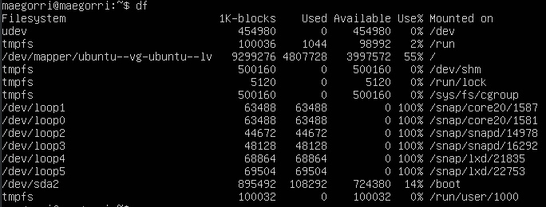 |
|:--:| 
| *Вывод команды `df`* |

    - Размер раздела: 9299276
    - Размер занятого пространства: 4807728
    - Размер свободного пространства: 3997572
    - Процент использования: 55%
    - Единица измерения: KB

2. Команда `df -Th`

| 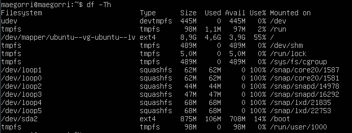 |
|:--:| 
| *Вывод команды `df -Th`* |

    - Размер раздела: 8.9G
    - Размер занятого пространства: 4.6G
    - Размер свободного пространства: 3.9G
    - Процент использования: 55% 
    - Тип файловой системы: ext4

## Part 12. Использование утилиты **du**

**== Задание ==**

##### Запустить команду du.
##### Вывести размер папок /home, /var, /var/log (в байтах, в человекочитаемом виде)
##### Вывести размер всего содержимого в /var/log (не общее, а каждого вложенного элемента, используя *)

- В отчёт вставить скрины с выводом всех использованных команд.

| 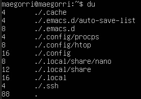 |
|:--:| 
| *Запуск команды `du`* |
||
| 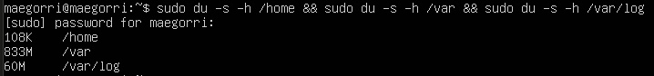 |
| *Вывод размера папок в человекочитаемом виде* |
||
| 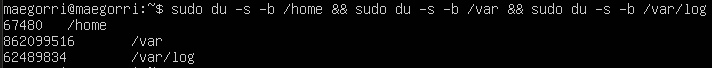 |
| *Вывод размера папок в байтах* |
||
| 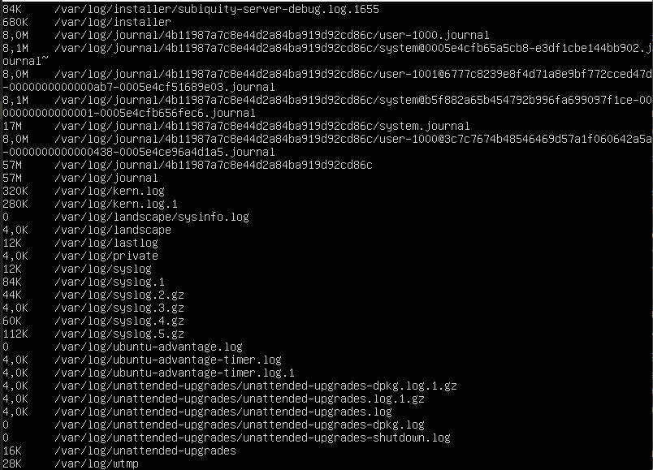 |
| *Рзамер всего содержимого папки `/var/log/*`* |

## Part 13. Установка и использование утилиты **ncdu**

**== Задание ==**

##### Установить утилиту ncdu.
##### Вывести размер папок /home, /var, /var/log.

- Размеры должны примерно совпадать с полученными в [Part 12](#part-12-использование-утилиты-du).

- В отчёт вставить скрины с выводом использованных команд.

| Команда | `sudo apt install ncdu` |
|:-|-:| 
| 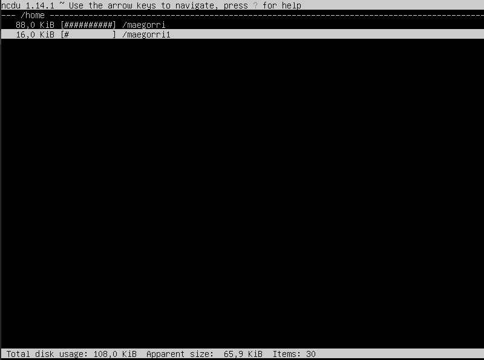 |
| *Размер папки `/home`* |
||
| 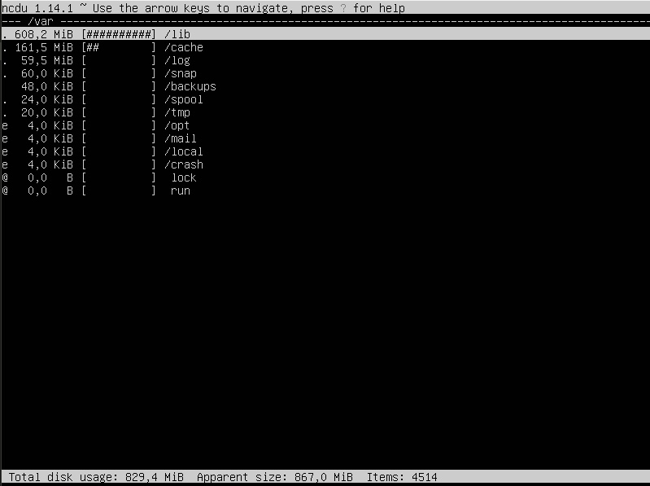 |
| *Размер папки `/var`* |
||
| 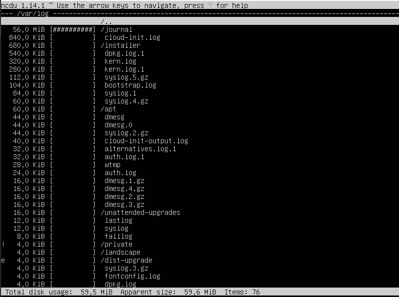 |
| *Размер папки `/var/log`* |

## Part 14. Работа с системными журналами

**== Задание ==**

##### Открыть для просмотра:
##### 1. /var/log/dmesg
##### 2. /var/log/syslog
##### 3. /var/log/auth.log  

- Написать в отчёте время последней успешной авторизации, имя пользователя и метод входа в систему.
- Перезапустить службу SSHd.
- Вставить в отчёт скрин с сообщением о рестарте службы (искать в логах).

| 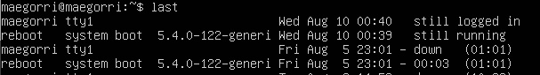 |
|:--:| 
| *Скришнот с информацией о последней авторизации* |

- Время последней успешной авторизации: Wed Aug 10 00:40
- Имя пользователя: maegorri
- Метод входа в систему: tty1

| 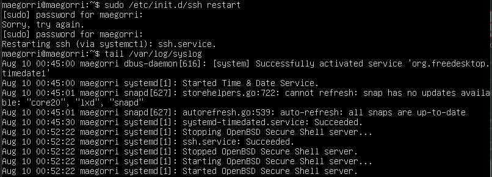 |
|:--:| 
| *Сообщение о рестарте службы `sshd`* |

## Part 15. Использование планировщика заданий **CRON**

**== Задание ==**

##### Используя планировщик заданий, запустите команду uptime через каждые 2 минуты.
- Найти в системных журналах строчки (минимум две в заданном временном диапазоне) о выполнении.
- Вывести на экран список текущих заданий для CRON.
- Вставить в отчёт скрины со строчками о выполнении и списком текущих задач.

##### Удалите все задания из планировщика заданий.
- В отчёт вставьте скрин со списком текущих заданий для CRON.

| Команда | `crontab -e` |
|:-|-:| 
| 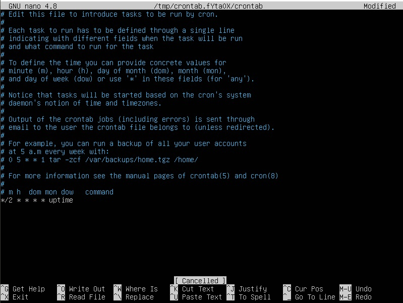 |
| *Планирование задачи в `cron`* |
||
| Команда | `crontab -l` |
| 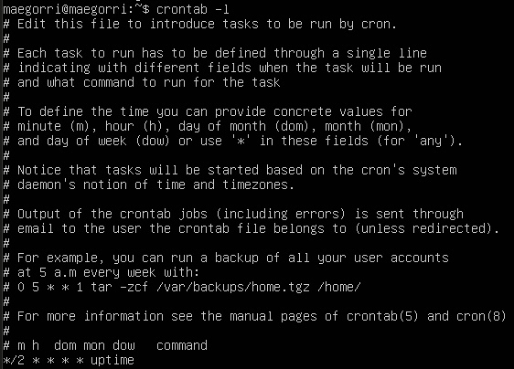 |
| *Список текущих задач* |
||
| 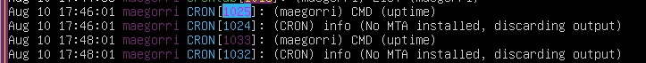 |
| *Файл `/var/log/syslog`* |
||
| Команда | `crontab -r` |
| 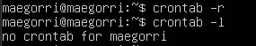 |
| *Список задач после удаления* |

