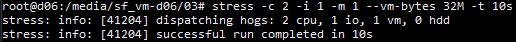

## Установка  

    wget https://github.com/prometheus/prometheus/releases/download/v2.42.0/prometheus-2.42.0.linux-amd64.tar.gz && \
    tar xvzf prometheus-2.42.0.linux-amd64.tar.gz && cd prometheus-* && ./prometheus --config.file=prometheus.yml

    wget https://dl.grafana.com/oss/release/grafana_9.2.4_amd64.deb && sudo dpkg -i grafana_9.2.4_amd64.deb && \
    sudo systemctl enable grafana-server && sudo systemctl start grafana-server

    wget https://github.com/prometheus/node_exporter/releases/download/v1.5.0/node_exporter-1.5.0.linux-amd64.tar.gz && \
    tar -xzf node_exporter-*.linux-amd64.tar.gz && cd node_exporter-*.linux-amd64/ && ./node_exporter

- https://devopscube.com/install-configure-prometheus-linux/
- https://losst.pro/ustanovka-i-nastrojka-prometheus (внимательно с опечатками)

## Доступ с локальной машины

- Создание аккаунта Grafana: admin\admin

## Настройка дашборда

- https://youtu.be/YUabB_7H710
- https://devconnected.com/monitoring-disk-i-o-on-linux-with-the-node-exporter/
- https://brian-candler.medium.com/interpreting-prometheus-metrics-for-linux-disk-i-o-utilization-4db53dfedcfc

## Состояние до запуска скрипта

## Запуск скрипта

## Состояние после запуска скрипта (и очистки)

## Запуск утилиты stress

    sudo apt install stress

## Показатели на дашборде

