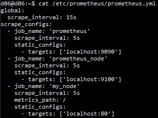
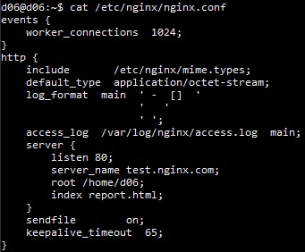
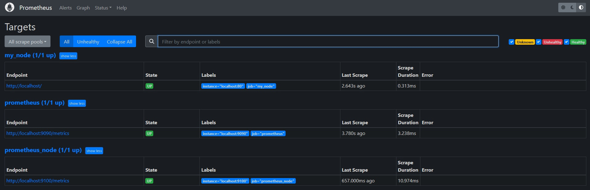
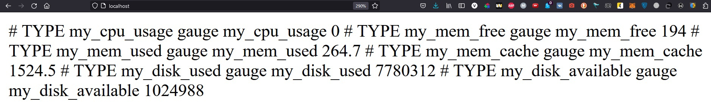
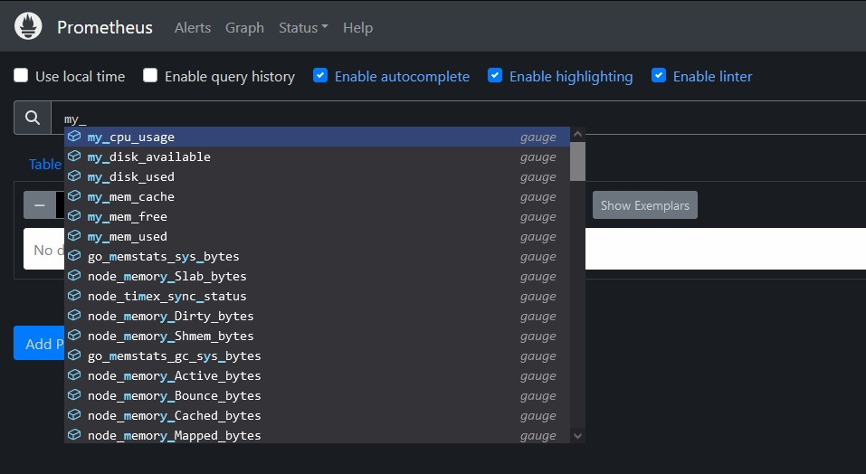

## Итоговый файл настроек /etc/prometheus/prometheus.yml

## Итоговый файл настроек /etc/nginx/nginx.conf

## Targets Prometheus

## Метрики по адресу localhost:80

## Проверяем, что Prometheus видит мои метрики

